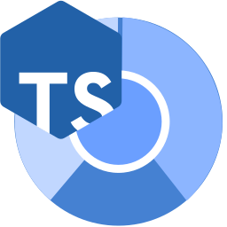

# ts-browser 

Run typescript files with imports on the fly. Like [ts-node](https://www.npmjs.com/package/ts-node), but for browser.

Perfect fallback solution for environments that are only supposed to host static source files (like [GitHub Pages](https://help.github.com/en/github/working-with-github-pages/about-github-pages)).

Usage: ([sample project](https://github.com/klesun/klesun.github.io/tree/master/entry/midiana))
```html
<!-- index.html -->
<script type="module">
    import {loadModule} from 'https://klesun.github.io/ts-browser/src/ts-browser.js';
    loadModule('./index.ts').then(indexModule => {
        return indexModule.default(document.getElementById('composeCont'));
    });
</script>
```
```typescript
// index.ts
import {makePanel} from './utils/SomeDomMaker';

export default (composeCont) => {
    composeCont.appendChild(makePanel());
};
```

The script uses [`typescriptServices.js`](https://github.com/microsoft/TypeScript/blob/master/lib/typescriptServices.d.ts) to parse ts file for dependencies and transpile it to js.

Each file loads about 10-50 milliseconds. Some basic optimization is applied during compilation, like using [web workers](https://developer.mozilla.org/en-US/docs/Web/API/Web_Workers_API/Using_web_workers) and storing compilation results in [`window.localStorage`](https://developer.mozilla.org/en-US/docs/Web/API/Window/localStorage), not sure if it can be optimised further, [would need research](https://github.com/klesun/ts-browser/issues/8).

The behaviour on circular dependencies may be not what you expect: I tried to mimick typescript's behaviour (which allows circular dependencies) by creating a [`Proxy` object](https://developer.mozilla.org/en-US/docs/Web/JavaScript/Reference/Global_Objects/Proxy) for the module which throws errors if you attempt to access a field before module fully loaded. If this appears to be inconsistent, you can file an issue with minimal example - I'll think of a better way to implement circular dependencies then.

There was a similar project once, called [typescript-script](https://github.com/basarat/typescript-script), but it was last updated 5 years ago, did not manage to get it working, and it does not seem to load dependencies.
_____________

If you prefer npm:

```
npm install ts-browser-klesun
```
```javascript
import {loadModule} from './node_modules/ts-browser-klesun/src/ts-browser.js';
```
(it's called [`ts-browser-klesun`](https://www.npmjs.com/package/ts-browser-klesun) in npm, don't confuse with [`ts-browser`](https://www.npmjs.com/package/ts-browser) which does a similar job, but by listing dependencies [in the html file](https://github.com/harrysolovay/ts-browser/blob/master/demo/index.html), not with `import`-s)
